# 🏙️ UrbanShield — AI-Powered Urban Infrastructure Risk Management & Decision Support

> **UrbanShield** is an end-to-end intelligent urban resilience platform that integrates real-world municipal flood datasets to assess flood risks, prioritize emergency interventions, and simulate disaster response scenarios across critical urban infrastructure in Chennai, India.

[]()
[](./backend/README.md)
[](./app/main.py)
[](./agent/orchestrator.py)
[-success.svg)](./backend/tests/smoke_test.py)

---

## 🏛️ System Architecture & Multi-Layer Pipeline

UrbanShield operates on a modular 6-layer intelligence pipeline powered by real municipal datasets:

$$\text{SENSE} \longrightarrow \text{PREDICT} \longrightarrow \text{PRIORITIZE} \longrightarrow \text{OPTIMIZE} \longrightarrow \text{RECOMMEND} \longrightarrow \text{SIMULATE}$$

1. **SENSE**: Ingests real surveyed inundation depths, GCC flood hotspots, IMD weather station telemetry, and CMDA flood hazard zones with Haversine spatial proximity matching across 16 monitored locations.
2. **PREDICT**: Evidence-based flood risk estimation ($0.0$ to $1.0$) and observational confidence scoring derived directly from ground-truth depth surveys and weather observations.
3. **PRIORITIZE**: Deterministic Multi-Criteria Decision Analysis (MCDA) assigning transparent urgency tiers (`CRITICAL`, `HIGH`, `MODERATE`, `LOW`).
4. **OPTIMIZE**: Constraint-based resource allocation using **Google OR-Tools CP-SAT Solver** to maximize covered priority score within pump, crew, and budget caps (in ₹ INR).
5. **RECOMMEND**: Generates actionable operational directives (*e.g., "REPAIR & DISPATCH IMMEDIATELY"*) and deterministic natural language briefings for emergency dispatchers.
6. **SIMULATE**: In-memory "What-If" crisis simulation engine evaluating hypothetical deluges, storm surges, or budget contractions with side-by-side delta metrics.

```mermaid
graph LR
    subgraph SENSE ["1. SENSE"]
        D1[OpenCity Inundation Data]
        D2[GCC Flood Hotspots]
        D3[IMD Weather Stations]
        D4[CMDA Flood Hazard Map]
        D5[Critical Infrastructure - REC]
    end

    subgraph CORE ["2-5. INTELLIGENCE ENGINE"]
        PREDICT[2. PREDICT: Evidence Risk Scoring]
        PRIORITIZE[3. PRIORITIZE: MCDA Ranking]
        OPTIMIZE[4. OPTIMIZE: Google OR-Tools CP-SAT]
        RECOMMEND[5. RECOMMEND: Action Directives]
    end

    subgraph SIM ["6. SIMULATE"]
        SIMULATE[What-If Scenario Delta Engine]
    end

    SENSE --> CORE --> SIM
```



---

## 📊 Real Data Sources & Provenance

UrbanShield uses publicly available real-world Chennai rainfall and flood/inundation datasets:

* **OpenCity / Greater Chennai Corporation (GCC)**: 192 surveyed ground-truth flood inundation points with measured water depths and field inspection remarks.
* **GCC Disaster Management Cell**: 53 designated municipal flood hotspots identified during Cyclone Nivar and extreme monsoon events.
* **India Meteorological Department (IMD)**: 119 weather station records providing observed rainfall metrics across the Chennai metropolitan area.
* **CMDA / GCC Master Plan**: 7,453 geospatial polygons categorizing flood hazard susceptibility.
* **Critical Infrastructure (REC Campus)**: Rajalakshmi Engineering College (Thandalam, Chennai — `13.009644, 80.004336`) integrated with distance-weighted spatial proximity to nearest IMD Chembarambakkam station (`47.0mm`, `5.76km`).

*For complete data provenance and methodology, see [`docs/data_sources.md`](./docs/data_sources.md).*

> **Disclaimer**: *UrbanShield uses publicly available historical Chennai rainfall, inundation and flood-hazard observations. The current prototype performs evidence-based risk estimation rather than claiming a fully trained real-world predictive ML model. Future versions will integrate larger time-aligned historical datasets for supervised prediction.*

---

## 📂 Repository Organization

```
UrbanShield/
├── app/                         # 📊 Interactive Streamlit Frontend Dashboard
│   └── main.py                  # Streamlit Multi-Page App (Folium Geospatial Map + Stepper + Simulator)
│
├── backend/                     # 🛡️ Backend REST API, SQLite Database, & Tests
│   ├── app.py                   # Flask Application Factory & Blueprints
│   ├── models.py                # Asset, RiskAssessment, PriorityRanking, Recommendation, Simulation
│   ├── routes/                  # REST Endpoints (/api/system, /api/dashboard, /api/zones/real, etc.)
│   ├── services/                # Evidence Risk Engine & Resilient Agent Client
│   └── tests/                   # 71-Point Automated Smoke Test Suite
│
├── layers/                      # 🤖 Multi-Layer AI Intelligence System
│   ├── sense.py                 # Layer 1: Real Chennai Data Ingestion & Spatial Joining (16 Locations)
│   ├── predict.py               # Layer 2: Evidence-Based Flood Risk Estimation
│   ├── prioritize.py            # Layer 3: Deterministic MCDA Urgency Ranking
│   ├── optimize.py              # Layer 4: Google OR-Tools CP-SAT Resource Optimization (₹ INR)
│   ├── recommend.py             # Layer 5: Action Directives & Executive Briefings
│   └── simulate.py              # Layer 6: What-If Crisis Scenario Engine
│
├── agent/                       # 🔗 Agent Pipeline Orchestrator & Server Bridges
│   ├── orchestrator.py          # End-to-End Pipeline Execution Engine
│   └── server.py                # Standalone HTTP Agent Server (Port 8000)
│
├── data/                        # 📈 Real Chennai Datasets (KML, CSV, SQLite Database)
│   ├── opencity_inundation_points.kml
│   ├── opencity_gcc_flood_hotspots_2020.kml
│   ├── chennai_rainfall_stations.csv
│   ├── opencity_flood_hazard_zones.kml
│   ├── zones.csv
│   └── urbanshield.db
│
└── docs/                        # 📖 Architecture & Data Documentation
    ├── data_sources.md          # Complete Real Data Provenance & Citations
    └── ai_ml_answers.md         # System Explainability & Decision Rationale
```

---

## 🚀 Running the System

### 1. Terminal 1: Start Agent HTTP Server (Port 8000)
```bash
python agent/server.py
```

### 2. Terminal 2: Start Flask Backend API (Port 5000)
```bash
python backend/app.py
```

### 3. Terminal 3: Start Streamlit Frontend Dashboard (Port 8501)
```bash
python -m streamlit run app/main.py
```
* **Frontend UI**: `http://localhost:8501`
* **Backend API**: `http://localhost:5000/api`
* **Agent Server**: `http://localhost:8000/agent`

### 4. Run the Automated Smoke Test Suite
```bash
python backend/tests/smoke_test.py
```
*Runs all 71 unit and integration tests across the multi-tier platform.*

---

## 👥 Team Members & Roles

- **Member 1 (Frontend Lead):** User Interface, Geospatial Maps, Simulation Graphs & Dashboard Experience.
- **Member 2 (Backend & Database Lead):** REST APIs, SQLite Schema, Deterministic Mock System & Agent Bridge.
- **Member 3 (AI / Intelligence Lead):** Multi-Layer Agent Intelligence, Sensor Telemetry Analysis & Optimization.

---
*Built during the 24-Hour Urban Resilience Hackathon.*
