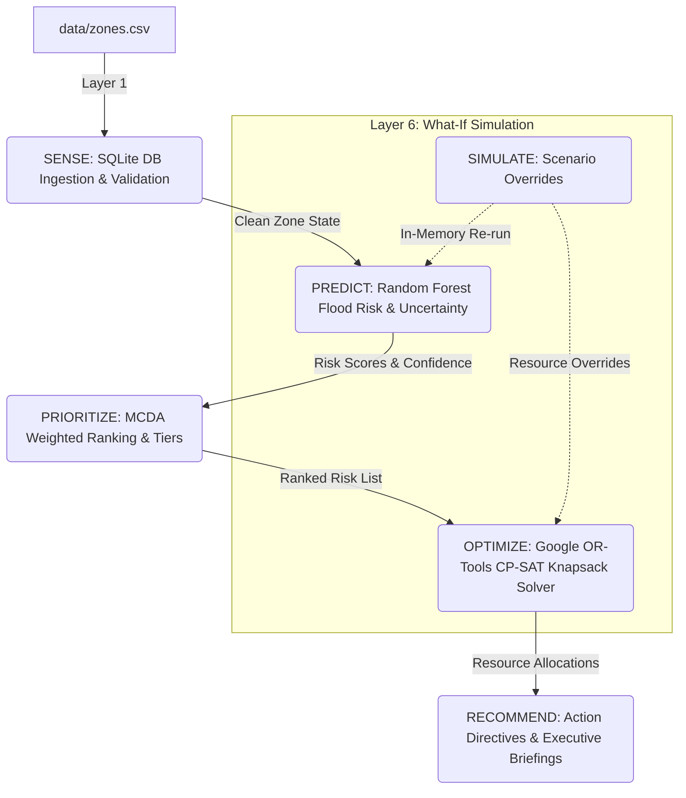

# 🛡️ UrbanShield

**AI-Powered Urban Flood Risk Management & Multi-Constraint Resource Allocation System**  
*Team Crusaders — Phoenix Hacks 24-Hour Hackathon Project*

---

## 📌 Executive Summary

During severe weather events, urban centers face simultaneous threats: flash flooding, drainage overflows, road degradation, and traffic paralysis. Municipal authorities operate under strict operational limits — a finite pool of mobile pumps, emergency response crews, and operational budget. They cannot fix every zone at once.

**UrbanShield** provides an auditable, end-to-end multi-layer decision pipeline that transforms raw environmental sensor data into optimized, actionable emergency resource dispatch plans.

UrbanShield systematically answers six core operational questions:
1. **SENSE**: *What is the current state of each urban zone?*
2. **PREDICT**: *What is the flood risk probability and uncertainty per zone?*
3. **PRIORITIZE**: *Which zones must take precedence based on risk, human population, and critical assets?*
4. **OPTIMIZE**: *How should limited pumps, crews, and budget be allocated for maximum civic impact?*
5. **RECOMMEND**: *What precise operational directive and executive briefing should be issued for every zone?*
6. **SIMULATE**: *What happens if conditions worsen or resource pools change?*

---

## 🏗️ System Architecture

UrbanShield is coordinated by a central orchestrator (`agent/orchestrator.py`) that manages a **6-stage sequential data pipeline**. Each layer feeds its output directly into the next, maintaining strict state separation and policy auditability.



---

## 🧩 The 6 Pipeline Layers

| Layer | Module | Method / Approach | Inputs $\rightarrow$ Outputs |
| :--- | :--- | :--- | :--- |
| **1. SENSE** | `layers/sense.py` | Deterministic Rule-Based ETL & SQLite DB Sync | Raw `zones.csv` $\rightarrow$ Validated SQLite `zones` Table & Clean Zone State DataFrame |
| **2. PREDICT** | `layers/predict.py` | `RandomForestClassifier` Ensemble + Voting Variance | Clean Zone State $\rightarrow$ `risk_score` (0-1 prob) + `risk_confidence` (0-1) |
| **3. PRIORITIZE** | `layers/prioritize.py` | Deterministic Multi-Criteria Decision Analysis (MCDA) | Risk & Zone Metrics $\rightarrow$ `priority_score` + `priority_rank` + Named Tiers |
| **4. OPTIMIZE** | `layers/optimize.py` | Google OR-Tools CP-SAT (0-1 Multi-Knapsack Solver) | Ranked Zones + Resource Limits $\rightarrow$ Optimal Resource Allocation & Skip Reasons |
| **5. RECOMMEND** | `layers/recommend.py` | Deterministic Decision Matrix + Template Briefings | Allocation Plan $\rightarrow$ `recommended_action` + `executive_summary` |
| **6. SIMULATE** | `layers/simulate.py` | In-Memory Mutation & Selective Pipeline Re-invocation | Overrides (Rainfall / Budget / Crews) $\rightarrow$ BEFORE vs AFTER Comparison Delta |

---

## 📂 Project Repository Structure

```text
UrbanShield/
├── agent/
│   └── orchestrator.py        # Central UrbanShieldAgent pipeline coordinator
├── layers/
│   ├── sense.py               # Layer 1: Data ingestion, validation, and SQLite sync
│   ├── predict.py             # Layer 2: Random Forest ML model & uncertainty calculation
│   ├── prioritize.py          # Layer 3: Rule-based MCDA ranking formula & tiering
│   ├── optimize.py            # Layer 4: Google OR-Tools CP-SAT resource allocation solver
│   ├── recommend.py           # Layer 5: Action directive matrix & executive briefings
│   └── simulate.py            # Layer 6: What-if scenario simulator & delta generator
├── data/
│   ├── zones.csv              # Source CSV containing raw urban zone sensor metrics
│   └── urbanshield.db         # Persistent SQLite database (generated by SENSE layer)
├── models/
│   └── flood_rf_model.joblib  # Serialized pre-trained Random Forest model artifact
├── app/
│   └── main.py                # Streamlit dashboard UI — PLANNED (owned by Member 1, not yet implemented)
├── docs/
│   └── ai_ml_answers.md       # Comprehensive AI/ML explainability & architecture docs
├── requirements.txt           # Python dependency manifest
└── README.md                  # Project documentation
```

---

## 🚀 Quickstart & Installation

### 1. Prerequisites
- **Python 3.8+** (Tested on Python 3.8 / 3.10 / 3.11)
- Git

### 2. Setup Environment
```bash
# Clone the repository
git clone https://github.com/vandhana-07/UrbanShield.git
cd UrbanShield

# Install required dependencies
pip install -r requirements.txt
```

---

## 💻 Running UrbanShield

### 1. Run the Full Orchestrated Pipeline
Execute the central agent orchestrator to trace the complete end-to-end pipeline:
```bash
python agent/orchestrator.py
```

**Expected Console Output**:
```text
INFO: ==================================================
INFO:  STARTING URBANSHIELD EMERGENCY RESPONSE PIPELINE 
INFO: ==================================================
INFO: [LAYER 1: SENSE] Ingesting CSV and syncing SQLite database state...
INFO: [LAYER 1: SENSE] Success. Structured state loaded for 10 valid zones.
INFO: [LAYER 2: PREDICT] Estimating Random Forest flood risk scores and uncertainty...
INFO: [LAYER 2: PREDICT] Success. Generated risk_score and risk_confidence for 10 zones.
INFO: [LAYER 3: PRIORITIZE] Ranking zones using Multi-Criteria Decision Analysis (MCDA)...
INFO: [LAYER 3: PRIORITIZE] Success. Ranked 10 zones. Top Priority: Old Town Market.
INFO: [LAYER 4: OPTIMIZE] Allocating resources via Google OR-Tools CP-SAT Solver...
INFO: CP-SAT Solver Status: OPTIMAL (Solve Time: 0.0276s)
INFO: [LAYER 4: OPTIMIZE] Success. Solver Status: OPTIMAL. Serviced 3 zones.
INFO: [LAYER 5: RECOMMEND] Translating allocation plan into action directives & briefings...
INFO: [LAYER 5: RECOMMEND] Success. Generated directives and executive summaries.
INFO: ==================================================
INFO:  PIPELINE EXECUTION COMPLETED SUCCESSFULLY       
INFO: ==================================================

====================================================================================================
 URBANSHIELD AGENT — END-TO-END PIPELINE SUMMARY
====================================================================================================
 Valid Zones Ingested : 10 zones
 ML Model Status      : Loaded / Active (models/flood_rf_model.joblib)
 Zones Ranked         : 10 zones (MCDA 0.0-1.0 scoring)
 Solver Status        : OPTIMAL (Solve Time: 0.0276s)
 Serviced Zones       : 3 / 10 zones
 Priority Coverage %  : 38.25% (2.3791 / 6.2195)
 Resource Utilization : Pumps: 5/6 | Crews: 4/4 | Budget: $430,000/$500,000
====================================================================================================

FINAL ACTIONABLE DIRECTIVES TABLE:
----------------------------------------------------------------------------------------------------
 priority_rank zone_id             zone_name  risk_score  priority_score allocation_status            recommended_action
             1     Z05       Old Town Market      1.0000          0.9500         ALLOCATED REPAIR & DISPATCH IMMEDIATELY
             2     Z02 Riverbank Residential      0.9996          0.7927           SKIPPED   ESCALATE FOR REINFORCEMENTS
             3     Z07     East Coastal Belt      1.0000          0.7765         ALLOCATED REPAIR & DISPATCH IMMEDIATELY
             4     Z08   University District      0.9996          0.7651           SKIPPED   ESCALATE FOR REINFORCEMENTS
             5     Z01   Downtown Commercial      0.9900          0.7556           SKIPPED   ESCALATE FOR REINFORCEMENTS
             6     Z09      West Highway Hub      1.0000          0.6526         ALLOCATED REPAIR & DISPATCH IMMEDIATELY
             7     Z04       Tech Park North      0.9483          0.6523           SKIPPED   INSPECT & MONITOR HIGH RISK
             8     Z03     Industrial Estate      0.5433          0.4480           SKIPPED            ROUTINE MONITORING
             9     Z10       Airport Enclave      0.1372          0.2764           SKIPPED            ROUTINE MONITORING
            10     Z06         South Suburbs      0.0123          0.1503           SKIPPED            ROUTINE MONITORING
====================================================================================================
```

### 2. Run Individual Layers Standalone
Each layer in `layers/` is designed with its own standalone execution entrypoint:
```bash
python layers/sense.py       # Ingests CSV & prints SQLite database state
python layers/predict.py     # Trains/loads Random Forest & evaluates metrics
python layers/prioritize.py  # Computes MCDA scores & tier rankings
python layers/optimize.py    # Runs OR-Tools CP-SAT resource allocation solver
python layers/recommend.py   # Outputs action directives & executive briefings
python layers/simulate.py   # Runs what-if scenarios & outputs BEFORE vs AFTER deltas
```

---

## 🧠 Explainability & AI/ML Rationale

UrbanShield enforces an explicit rule: **Use Machine Learning only where genuinely needed (PREDICT), and rely on deterministic, auditable rules or solvers everywhere else.**

A complete technical breakdown is documented in [docs/ai_ml_answers.md](file:///c:/URBANSHIELD/docs/ai_ml_answers.md). Below is a summary for reviewers and hackathon judges:

### 1. PREDICT Layer (Machine Learning)
- **Model**: `scikit-learn` `RandomForestClassifier` (`n_estimators=100`, `max_depth=8`, `random_state=42`).
- **Why ML**: Flood severity involves non-linear feature interactions (e.g. moderate rainfall on damaged roads with clogged drainage). Linear models miss non-linear overflow thresholds.
- **Uncertainty Quantification**: Continuous `risk_confidence` ($1.0 - 2\sigma$) derived from tree voting variance across the 100 decision trees.
- **Reproducibility**: Enforces fixed seed (`random_state=42`) across data splits and model training.

> [!IMPORTANT]
> **Synthetic Label Circularity Disclosure**  
> *Synthetic labels were derived from a formula using the same physical features the model trains on. The resulting accuracy (~0.99) and ROC-AUC (~0.999) reflect this synthetic setup. Real-world deployment on satellite/sensor historical logs would show lower, realistic performance.*

### 2. PRIORITIZE Layer (Rule-Based MCDA)
- **Formula**:
  $$\text{raw\_priority} = 0.50 \cdot \text{risk\_score} + 0.30 \cdot \text{norm\_pop} + 0.20 \cdot \text{norm\_infra}$$
  $$\text{priority\_score} = \text{raw\_priority} \cdot (0.85 + 0.15 \cdot \text{risk\_confidence})$$
- **Why Rule-Based**: Emergency priority ranking requires 100% auditability and guaranteed linear monotonicity. ML rankers can introduce non-monotonic rank flips.

### 3. OPTIMIZE Layer (Constraint Solver)
- **Engine**: Google OR-Tools CP-SAT Solver.
- **Formulation**: 0-1 Multi-Dimensional Knapsack problem maximizing total priority score subject to pump units ($\le 6$), rescue crews ($\le 4$), and budget cap ($\le \$500,000$).
- **Why Solver vs. Greedy**: Greedy top-N selection is sub-optimal (e.g., spending all crews on Rank #1 while leaving pumps and money idle). CP-SAT searches the global combinatorial space for maximum civic coverage.

### 4. RECOMMEND Layer (Deterministic Matrix + Briefing Templates)
- **Action Directives**: Rule-based decision matrix (`REPAIR & DISPATCH IMMEDIATELY`, `ESCALATE FOR REINFORCEMENTS`, `INSPECT & MONITOR HIGH RISK`, `ROUTINE MONITORING`).
- **Briefing Synthesis**: Structured natural language templates used to guarantee **100% offline reliability during live hackathon judging** without external API key dependencies.

### 5. SIMULATE Layer (Pipeline Re-invocation)
- **In-Memory Isolation**: Overrides apply strictly to an in-memory DataFrame copy (`working_zone_state = baseline_zone_state.copy()`). SQLite `data/urbanshield.db` remains 100% untouched.
- **Selective Re-run**: Re-runs `PREDICT` $\rightarrow$ `PRIORITIZE` $\rightarrow$ `OPTIMIZE` $\rightarrow$ `RECOMMEND` for zone metric changes, or `OPTIMIZE` $\rightarrow$ `RECOMMEND` for resource cap changes.

---

## 👥 Team Crusaders (Phoenix Hacks)

Developed for the 24-Hour Phoenix Hacks Hackathon.

* **Member 1**: Frontend & GIS Viz (Streamlit / Folium map UI)
* **Member 2**: Data Engineering & DB Integration
* **Member 3 (AI/ML & Pipeline Lead)**: Multi-Layer Agent Orchestration, ML Models, CP-SAT Optimization Solver, Explainability Pipeline
* **Member 4**: Research, Domain Modeling & Hackathon Pitch Lead

---

## 📜 License

MIT License — free for open-source use, research, and adaptation for civic emergency risk management.
