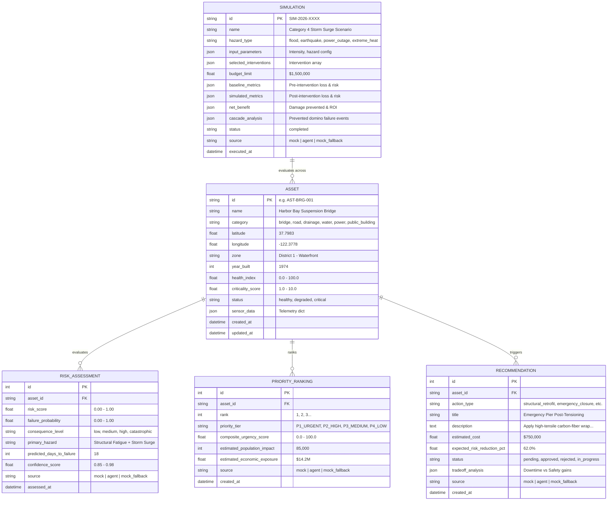

# 🛡️ UrbanShield — Backend API & Intelligence Engine

> **AI-Powered Urban Infrastructure Risk Management & Decision-Support System**  
> *Built for high-stakes municipal resilience, catastrophic failure prevention, and real-time intervention optimization.*

[](https://python.org)
[](https://flask.palletsprojects.com/)
[](https://sqlite.org)
[-orange.svg)](http://localhost:5000/api)
[-brightgreen.svg)]()
[-success.svg)]()

---

## 📑 Table of Contents

- [Overview & Architecture](#-overview--architecture)
- [System Pipeline Flow](#-system-pipeline-flow)
- [Key Features](#-key-features)
- [Tech Stack & Design Rationale](#-tech-stack--design-rationale)
- [Quickstart Guide](#-quickstart-guide)
- [Database Schema & Entities](#-database-schema--entities)
- [API Reference & Examples](#-api-reference--examples)
  - [System & Health](#1-system--health)
  - [Dashboard Summary](#2-dashboard-summary)
  - [Infrastructure Assets](#3-infrastructure-assets)
  - [Risk Assessments & Prioritization](#4-risk-assessments--prioritization)
  - [Actionable Recommendations](#5-actionable-recommendations)
  - [What-If Simulations](#6-what-if-simulations)
- [Multi-Layer AI Agent Integration Contract](#-multi-layer-ai-agent-integration-contract)
- [Configuration (.env)](#-configuration-env)
- [Testing & Quality Assurance](#-testing--quality-assurance)
- [Hackathon Tradeoffs (What We Explicitly Cut)](#-hackathon-tradeoffs-what-we-explicitly-cut)

---

## 🏛️ Overview & Architecture

**UrbanShield** provides municipal authorities, disaster response teams, and city planners with predictive visibility into critical infrastructure vulnerabilities across **bridges, road networks, drainage systems, water treatment lines, power grids, and emergency facilities**.

The backend serves as the central data store, simulation engine, and integration layer connecting the **Frontend Dashboard (Member 1)** and the **Multi-Layer AI Agent (Member 3)**.

### Architectural Blueprint

```mermaid
flowchart TB
    subgraph Client ["Frontend Layer (Member 1)"]
        UI["UrbanShield Dashboard (React / Vite / Next)"]
    end

    subgraph Backend ["Backend Layer (Member 2 - Port 5000)"]
        Router["Flask REST API Router (/api)"]
        Auth["CORS & Error Envelopes"]
        
        subgraph CoreServices ["Core Services"]
            MockEngine["Deterministic Mock Engine\n(Domain Formulas & Seed Data)"]
            AgentClient["Resilient Agent Client\n(6.0s Timeout & Auto-Fallback)"]
        end

        DB[(SQLite Database\nurbanshield.db)]
    end

    subgraph AI ["AI Agent Layer (Member 3 - Port 8000)"]
        AgentServer["Multi-Layer Intelligence Agent\n(Sense → Predict → Recommend → Simulate)"]
    end

    UI <-->|JSON REST HTTP| Router
    Router --> Auth
    Auth --> AgentClient
    
    AgentClient -->|MOCK_MODE=false\nHTTP POST (5-8s timeout)| AgentServer
    AgentClient -.->|On Failure / Timeout / MOCK_MODE=true| MockEngine
    
    MockEngine --> DB
    AgentClient --> DB
    Router --> DB
```

---

## 🔄 System Pipeline Flow

UrbanShield models infrastructure resilience across a 7-stage operational pipeline:

$$\text{Data} \longrightarrow \text{Sense} \longrightarrow \text{Predict} \longrightarrow \text{Prioritize} \longrightarrow \text{Optimize} \longrightarrow \text{Recommend} \longrightarrow \text{Simulate}$$

1. **Data:** 25 pre-seeded municipal assets with geographical coordinates, age, and operational baseline.
2. **Sense:** Dynamic telemetry payload ingestion (vibrations in Hz, strain, line pressure, temperature, tilt).
3. **Predict:** Probability of failure ($P_f \in [0, 1]$), estimated days to failure, and primary hazard identification.
4. **Prioritize:** Composite Urgency Score ($0 - 100$) evaluating hazard level, population exposure, and economic risk to assign **P1–P4** urgency tiers.
5. **Optimize:** Cost-benefit evaluation and tradeoff modeling (safety margin gains vs. downtime hours).
6. **Recommend:** Specific mitigation protocols (pier retrofitting, automated PRV relief, feeder balancing).
7. **Simulate:** Synchronous what-if stress-testing evaluating multi-asset cascade collapse under flood, earthquake, heat, or blackout scenarios.

---

## ✨ Key Features

- **🚀 Mock-First & Zero-Downtime Design:** The backend runs 100% standalone out-of-the-box. If Member 3's AI agent is offline or rebooting, the backend automatically and silently degrades to the built-in mathematical mock engine.
- **🏷️ Transparent 3-State Source Tagging:** Every API payload explicitly discloses its data origin in `meta.source`:
  - `"mock"`: Generated via local deterministic mathematical models.
  - `"agent"`: Computed live by Member 3's Multi-Layer AI agent.
  - `"mock_fallback"`: Agent timed out (> 6.0s) or failed; backend seamlessly protected the frontend with fallback data.
- **⚡ Synchronous Simulation Engine:** `POST /api/simulations/run` evaluates baseline damage, mitigated damage, cost-benefit ROI, and cascade failure prevention in **under 50 milliseconds**—no polling or WebSockets needed.
- **🗺️ GIS Map-Ready:** All 25 assets include clustered metropolitan latitude/longitude coordinates ready for instant rendering in Mapbox, Leaflet, or Google Maps.
- **🔒 Universal CORS Support:** Pre-configured to accept requests from any frontend port (`5173`, `3000`, `8080`, etc.).

---

## 🛠️ Tech Stack & Design Rationale

| Component | Choice | Hackathon Justification |
|---|---|---|
| **Language** | **Python 3.11+** | Rapid prototyping, native integration with AI/ML systems, clean syntax. |
| **Framework** | **Flask 3.0** | Lightweight, synchronous, zero-boilerplate, predictable request lifecycles. |
| **ORM** | **Flask-SQLAlchemy** | Clean object-relational mapping with model serialization methods (`to_dict()`). |
| **Database** | **SQLite 3** | Zero setup, zero passwords, zero Docker. Single-file portability (`urbanshield.db`). |
| **HTTP Client** | **Requests** | Synchronous REST calls to Member 3 with strict 6.0s connection and read timeouts. |
| **Environment** | **python-dotenv** | Clean separation of secrets and environment toggles. |

---

## 🚀 Quickstart Guide

### Prerequisites
- **Python 3.10+** (Tested on Python 3.11 & 3.14)
- **Git**

### 1. Clone & Navigate
```bash
git clone https://github.com/vandhana-07/UrbanShield.git
cd UrbanShield/backend
```

### 2. Set Up Virtual Environment

**On Windows (PowerShell):**
```powershell
python -m venv venv
.\venv\Scripts\Activate.ps1
```

**On Windows (Command Prompt):**
```cmd
python -m venv venv
venv\Scripts\activate.bat
```

**On macOS / Linux:**
```bash
python3 -m venv venv
source venv/bin/activate
```

### 3. Install Dependencies
```bash
pip install -r requirements.txt
```

### 4. Initialize & Seed Database
Populate SQLite with 25 diverse assets, risks, priority tiers, recommendations, and sample simulations:
```bash
python seed.py
```
*Output: `Database seeded successfully with 25 assets, 25 risks, 25 priorities, 25 recommendations, and 1 simulation!`*

### 5. Run Smoke Test Suite
Verify that all 11 endpoints and error validators pass with 100% success:
```bash
python tests/smoke_test.py
```

### 6. Start the Backend API Server
```bash
python app.py
```
- Server URL: **`http://localhost:5000`**
- API Base: **`http://localhost:5000/api`**

---

## 🗄️ Database Schema & Entities



---

## 📡 API Reference & Examples

### Standard Response Envelopes

**Success Envelope (200 / 201):**
```json
{
  "success": true,
  "data": { ... },
  "meta": {
    "source": "mock",
    "timestamp": "2026-08-19T14:00:00.000000Z",
    "version": "v1"
  }
}
```

**Error Envelope (400 / 404 / 405 / 500):**
```json
{
  "success": false,
  "error": {
    "code": "VALIDATION_ERROR",
    "message": "Missing required field: 'hazard_type'",
    "details": ["'intensity' must be a float between 0.0 and 1.0"]
  },
  "meta": {
    "timestamp": "2026-08-19T14:00:00.000000Z",
    "version": "v1"
  }
}
```

---

### 1. System & Health

#### `GET /api/system/status`
Returns backend health, active mock/live mode, agent connectivity, and asset count.

```bash
curl -X GET http://localhost:5000/api/system/status
```

**Response (200 OK):**
```json
{
  "success": true,
  "data": {
    "status": "healthy",
    "mock_mode": true,
    "active_source": "mock",
    "agent_endpoint": "http://localhost:8000",
    "agent_connected": false,
    "database": "sqlite_connected",
    "total_assets": 25,
    "last_agent_call": null
  },
  "meta": { "source": "system", "timestamp": "2026-08-19T14:00:00Z", "version": "v1" }
}
```

---

### 2. Dashboard Summary

#### `GET /api/dashboard/summary`
Returns city-wide aggregated KPIs and top 5 urgent infrastructure intervention candidates.

```bash
curl -X GET http://localhost:5000/api/dashboard/summary
```

**Response (200 OK):**
```json
{
  "success": true,
  "data": {
    "summary": {
      "total_assets": 25,
      "critical_count": 7,
      "degraded_count": 10,
      "healthy_count": 8,
      "city_wide_risk_score": 64.2,
      "total_budget_required_usd": 8620000.0,
      "pending_recommendations_count": 25
    },
    "urgent_interventions": [
      {
        "rank": 1,
        "asset_id": "AST-BRG-001",
        "asset_name": "Harbor Bay Suspension Bridge",
        "category": "bridge",
        "zone": "District 1 - Waterfront",
        "risk_score": 0.945,
        "priority_tier": "P1_URGENT",
        "composite_urgency_score": 93.8,
        "primary_hazard": "Structural Fatigue & Heavy Load Shear",
        "top_recommendation": "Emergency Pier Post-Tensioning & Deck Jacketing",
        "estimated_cost": 847500.0
      }
    ]
  },
  "meta": { "source": "mock", "timestamp": "2026-08-19T14:00:00Z", "version": "v1" }
}
```

---

### 3. Infrastructure Assets

#### `GET /api/assets`
Lists all assets with optional filtering.
- **Query Params:**
  - `category` (e.g. `bridge`, `road`, `drainage`, `water`, `power`, `public_building`)
  - `status` (`healthy`, `degraded`, `critical`)
  - `zone` (e.g. `District 1`, `Waterfront`)

```bash
curl -X GET "http://localhost:5000/api/assets?category=bridge&status=critical"
```

#### `GET /api/assets/<asset_id>`
Retrieves deep-dive asset metadata, telemetry, latest risk score, and all attached recommendations.

```bash
curl -X GET http://localhost:5000/api/assets/AST-BRG-001
```

#### `POST /api/assets`
Registers a new asset and automatically computes initial risk, priority tier, and recommendation.

```bash
curl -X POST http://localhost:5000/api/assets \
  -H "Content-Type: application/json" \
  -d '{
    "name": "East Channel Floodgate 2",
    "category": "drainage",
    "latitude": 37.791,
    "longitude": -122.383,
    "zone": "District 1 - Waterfront",
    "year_built": 2002,
    "health_index": 72.0,
    "criticality_score": 8.5,
    "sensor_data": {"water_flow_m3s": 38.2}
  }'
```

---

### 4. Risk Assessments & Prioritization

#### `GET /api/risks`
Lists all active risk evaluations sorted by `risk_score` descending.

#### `GET /api/priorities`
Lists prioritized intervention queue ordered by `rank` (1 to N) with economic and population impact estimates.

```bash
curl -X GET http://localhost:5000/api/priorities
```

---

### 5. Actionable Recommendations

#### `GET /api/recommendations`
Lists AI-generated intervention proposals.
- **Query Params:** `?status=pending` or `?asset_id=AST-BRG-001`

#### `PATCH /api/recommendations/<id>`
Approves, rejects, or updates the lifecycle state of a decision.

```bash
curl -X PATCH http://localhost:5000/api/recommendations/1 \
  -H "Content-Type: application/json" \
  -d '{"status": "approved"}'
```

---

### 6. What-If Simulations

#### `POST /api/simulations/run`
**Synchronously executes a what-if crisis simulation.** Compares unmitigated catastrophic baseline losses against user-selected interventions.

```bash
curl -X POST http://localhost:5000/api/simulations/run \
  -H "Content-Type: application/json" \
  -d '{
    "name": "100-Year Coastal Flood Surge Scenario",
    "hazard_type": "flood",
    "intensity": 0.85,
    "selected_interventions": [
      {
        "asset_id": "AST-DRN-001",
        "action": "activate_auxiliary_floodgates"
      },
      {
        "asset_id": "AST-BRG-001",
        "action": "structural_reinforcement"
      }
    ],
    "budget_limit": 1500000
  }'
```

**Response (201 Created):**
```json
{
  "success": true,
  "data": {
    "simulation_id": "SIM-20260819-B4A1",
    "name": "100-Year Coastal Flood Surge Scenario",
    "hazard_type": "flood",
    "intensity": 0.85,
    "budget_limit": 1500000.0,
    "status": "completed",
    "baseline_metrics": {
      "total_risk_score": 78.4,
      "expected_direct_damage_usd": 89400000.0,
      "critical_assets_failing": 7,
      "population_disrupted": 482000
    },
    "simulated_metrics": {
      "total_risk_score": 38.2,
      "expected_direct_damage_usd": 24200000.0,
      "critical_assets_failing": 2,
      "population_disrupted": 94000
    },
    "net_benefit": {
      "risk_reduction_pct": 51.3,
      "damage_prevented_usd": 65200000.0,
      "roi_ratio": 43.47
    },
    "cascade_analysis": [
      {
        "asset_id": "AST-DRN-001",
        "asset_name": "Lower River Levee & Sea Dike 7",
        "action_taken": "Intervention Applied",
        "impact": "Stabilized Lower River Levee & Sea Dike 7; prevented cascading overload into neighboring grid nodes."
      }
    ],
    "source": "mock",
    "executed_at": "2026-08-19T14:00:00.000000Z"
  },
  "meta": { "source": "mock", "timestamp": "2026-08-19T14:00:00Z", "version": "v1" }
}
```

#### `GET /api/simulations`
Lists history of previous simulation runs.

#### `GET /api/simulations/<id>`
Retrieves full metrics and cascade graph breakdown for a past simulation.

---

## 🤖 Multi-Layer AI Agent Integration Contract

When Member 3's AI Agent server is running on `http://localhost:8000`, flip `MOCK_MODE=false` in `.env`. The backend interacts with the agent via synchronous HTTP REST with a **6.0-second timeout**.

### Expected Endpoints on Member 3's Agent Server (`localhost:8000`):

1. **`GET /agent/health`**
   - Returns: `{"status": "ready", "version": "1.0"}`
2. **`POST /agent/analyze`**
   - Receives: `{"assets": [ ... ]}`
   - Returns: `{"assessments": [ {"asset_id": "...", "risk_score": 0.92, "priority_tier": "P1_URGENT", "recommendations": [ ... ]} ]}`
3. **`POST /agent/simulate`**
   - Receives: `{"hazard_type": "flood", "intensity": 0.85, "selected_interventions": [ ... ], "assets_snapshot": [ ... ]}`
   - Returns: `{"baseline_metrics": { ... }, "simulated_metrics": { ... }, "net_benefit": { ... }, "cascade_analysis": [ ... ]}`

---

## ⚙️ Configuration (.env)

Create a `.env` file in `UrbanShield-Team/backend/` (or copy `.env.example`):

```env
# Server Configuration
FLASK_ENV=development
PORT=5000

# Mock vs. Live Intelligence Mode
# Set to 'false' when Member 3's AI Agent is running on localhost:8000
MOCK_MODE=true

# AI Agent Service Settings (Member 3)
AGENT_URL=http://localhost:8000
AGENT_TIMEOUT_SECONDS=6.0

# Database Settings (Local SQLite)
DATABASE_URL=sqlite:///urbanshield.db
```

---

## 🧪 Testing & Quality Assurance

The backend includes a comprehensive, automated smoke test suite in `tests/smoke_test.py`.

```bash
python tests/smoke_test.py
```

### Coverage Scope:
- ✅ **System Health & Config Validation:** `GET /api/system/status`
- ✅ **Dashboard KPIs & Urgency Aggregations:** `GET /api/dashboard/summary`
- ✅ **Asset CRUD & Category Filtering:** `GET /api/assets`, `GET /api/assets?category=bridge`
- ✅ **Single Asset Deep-Dive & Relationship Joins:** `GET /api/assets/AST-BRG-001`
- ✅ **Asset Creation & Dynamic Risk Scored Ingestion:** `POST /api/assets`
- ✅ **Risk Severity Sorting:** `GET /api/risks`
- ✅ **Priority Ranks & Urgent Tiers:** `GET /api/priorities`
- ✅ **Recommendation Listing & Status Mutation:** `PATCH /api/recommendations/1`
- ✅ **Synchronous What-If Simulation Engine:** `POST /api/simulations/run`
- ✅ **Simulation History & Persistence:** `GET /api/simulations/<id>`
- ✅ **Validation Error Handlers:** 400 Bad Intensity, 404 Not Found, 405 Method Not Allowed

---

## 🚫 Hackathon Tradeoffs (What We Explicitly Cut)

To guarantee a rock-solid, zero-friction MVP in a 24-hour hackathon environment, the following were intentionally excluded:
- ❌ **No JWT / Passwords / Auth Walls:** Evaluators and teammates can immediately access the dashboard without login friction.
- ❌ **No Docker / PostgreSQL:** Avoids port collisions and connection string errors across teammate operating systems.
- ❌ **No Asynchronous Task Queues (Celery/Redis):** Synchronous execution eliminates broker maintenance and background worker failures.
- ❌ **No WebSockets:** Simple HTTP REST polling is 100x more stable and easier to debug during a live hackathon presentation.

---

## 👥 Teammate Contact & Coordination

- **Backend / Database Lead (Member 2):** Ready & Operational on `http://localhost:5000/api`
- **Frontend Lead (Member 1):** Point your API client to `http://localhost:5000/api` (CORS enabled for all ports).
- **AI Agent Lead (Member 3):** Implement `/agent/analyze` and `/agent/simulate` on port 8000 when ready.

---
*Built with ❤️ for Urban Resilience & Infrastructure Safety.*
